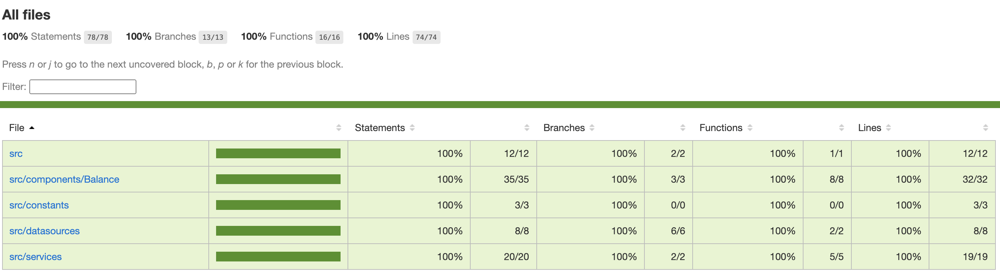

# Hodlnaut Coding Challenge

Thanks for taking the time to do our coding test!

__The reason we are using replit is so you don't have to go through the trouble of setting up a node.js environment. If you'd prefer to develop locally and upload your code to a git repo then feel free to do this and share the link.__

On the Hodlnaut website, users can have balances in various cryptocurrency assets including BTC and ETH. Users also want to view their total balance in another asset such as USD. To be able to do this, we need to fetch prices for pairs such as BTC/USD and ETH/USD to convert between assets.

To give an example, let’s say the user’s balance is 0.5 BTC and 2 ETH. If the current BTC/USD price is 60000 and the ETH/USD price is 3000, then the user’s total balance in USD would be 60000 \* 0.5 + 3000 \* 2 = 36000 USD.

### Submission
Please fork the repl.it, and share the link with us. You can add the answers to the question directly in the document.

----

## Task

Create __one API endpoint using Node and Express that takes in a user id and returns the user's total balance in USD__.

Keep the user’s balances stored in memory. An example of the data to be stored is provided at the end of this section. Feel free to add more entries or change the way the data is stored if you want, but this is not necessary.

You will need to fetch the current prices from a third party public API. You can use the price from any cryptocurrency exchange but it is recommended that you use Bitstamp.

Here is a link to their API docs: https://www.bitstamp.net/api/#ticker

Assume that the only assets that the user’s balance can contain are __BTC and ETH__.

Ensure the API endpoint works correctly by writing at least one test case using the __Mocha and Chai__ frameworks.

There is a test scaffold  `test.js` that you can use and `package.json` has been changed so that `npm run test` will run the unit tests.

It’s expected that this task should take less than 2-3 hours to complete. If you find yourself spending too much time on this task, then just give a short explanation about what aspects were particularly time consuming and what steps you would’ve done in order to complete the task.

Aim to write clear and concise code.

```
const userBalances = {
  "user-1": {
    "BTC": "0.5",
    "ETH": "2"
  },
  "user-2": {
    "BTC": "0.1",
  },
  "user-3": {
    "ETH": "5",
  },
}
```

## Questions
__1. (Optional) If you didn’t have time to complete your intended design, what else would you have done?__
> With more time and flexibility, the submitted solution could be improvised to have the following:
> - Better exception handling and error response.
> - Caching of third-party API if the use-case permits.
> - More efficient framework like Loopback-4 or NestJs for the faster development process.

__2. Which took the most time? What did you find most difficult?__
> - Setting up the project structure.
> - Destructing the working code components for better code scalability.

__3. If we wanted the balance to update on the frontend more often (10 times per second), how would you improve the current system to handle this?__
> The current solution relies on third-party calls whose rate-limiting is 8000 requests per 10 minutes. This limit is not enough for a larger user base.
> If we need to provide updates very frequent then it would be better to use bitstamp socket connection along with a socket server in the middle to relay the calculated balance to the frontend.

__4. How did you find the test overall? If you have any suggestions on how we can improve the test, we'd love to hear them!__
> I had fun doing the assignment. I had no experience with the REPL website, so I built it locally, but apart from that, I am happy with it.

## Test coverage

